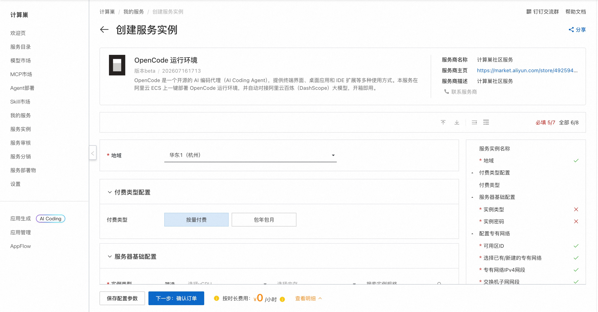
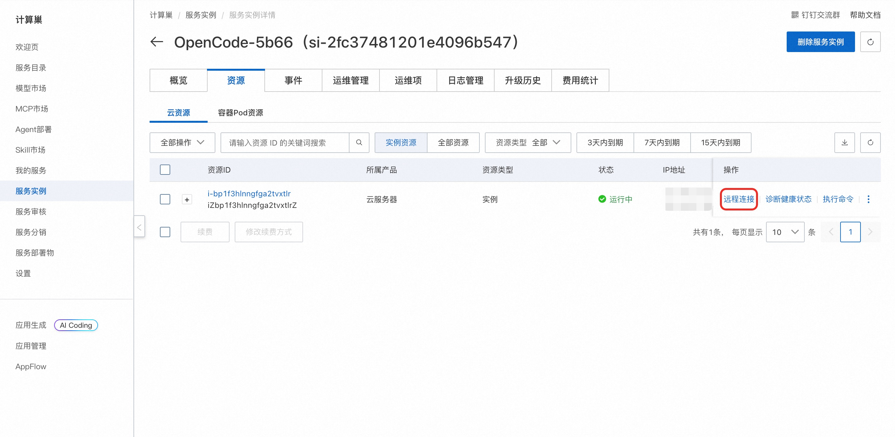
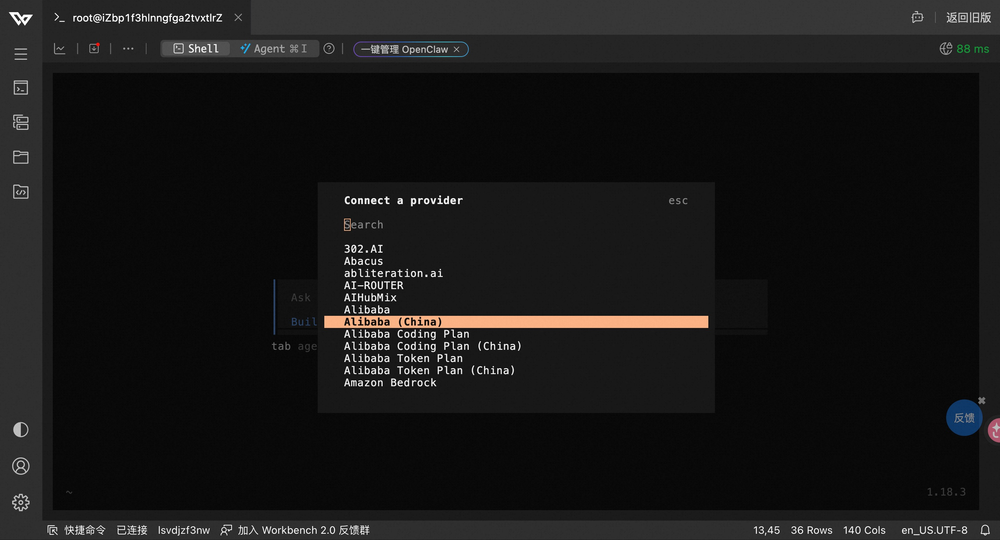

## OpenCode 简介

OpenCode 是一个开源的、运行在终端中的 AI 编程智能体（Agentic Coding Tool）。它能够理解整个代码库的上下文，通过自然语言交互帮助开发者完成代码编写、调试、重构、测试等任务。OpenCode 直接集成到终端工作流中，同时提供桌面应用和 IDE 扩展等多种使用方式，开箱即用。本服务在阿里云 ECS 上一键部署 OpenCode 运行环境，并自动对接阿里云百炼（DashScope）大模型。

### 核心特性

- **全代码库理解** — 自动索引和理解整个项目结构，无需手动指定上下文
- **多文件编辑** — 一次对话中可同时创建、修改多个文件，完成跨模块重构
- **终端命令执行** — 直接运行 Shell 命令、安装依赖、执行测试，反馈结果并自动修复
- **多种使用方式** — 支持终端界面、桌面应用与 IDE 扩展，适配不同工作流
- **模型自由接入** — 兼容多家模型服务，本服务默认对接阿里云百炼（DashScope）
- **扩展工具支持** — 支持 MCP 协议接入外部工具和数据源，扩展能力边界
- **会话记忆** — 支持上下文延续，长时间复杂任务可分步完成
- **多语言支持** — 覆盖 Python、JavaScript/TypeScript、Go、Rust、Java 等主流编程语言


## 部署流程

1. 单击[部署链接](https://computenest.console.aliyun.com/service/instance/create/cn-hangzhou?type=user&ServiceId=service-37d1aafd6c444cdd8440)，进入服务实例部署界面，根据界面提示填写参数（包括实例规格、实例密码以及百炼 API-KEY），可以看到对应询价明细，确认参数后点击**下一步：确认订单**。

    

2. 确认订单完成后同意服务协议并点击**立即创建**。

3. 等待部署完成后远程连接服务器。
    

4. 连接后执行以下命令启动 OpenCode：
    ```shell
    sudo su root
    cd /root
    opencode
    ```
   
   然后执行 /Connect 配置APIkey以及模型。

    

## 使用指南
请查看[官方文档](https://opencode.ai/docs/)

### 使用须知

- 本工具为第三方开源项目，阿里云仅提供云资源和部署入口支持，不对工具自身功能、生成内容、执行结果、服务可用性及额外费用承担责任。
